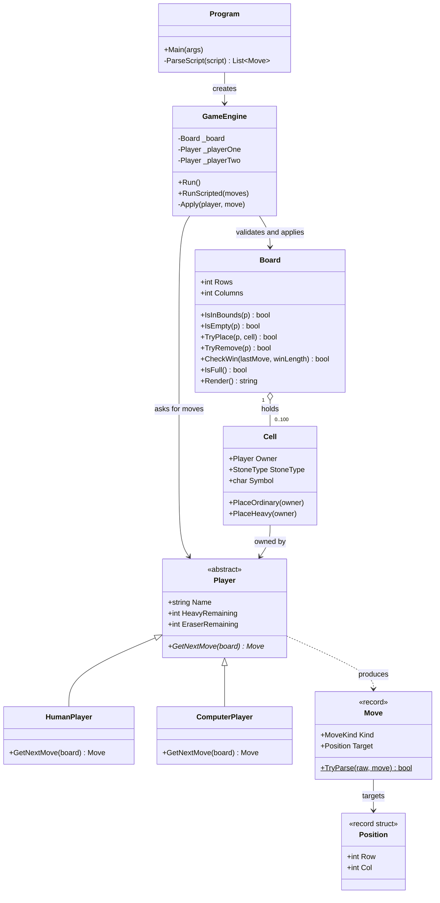
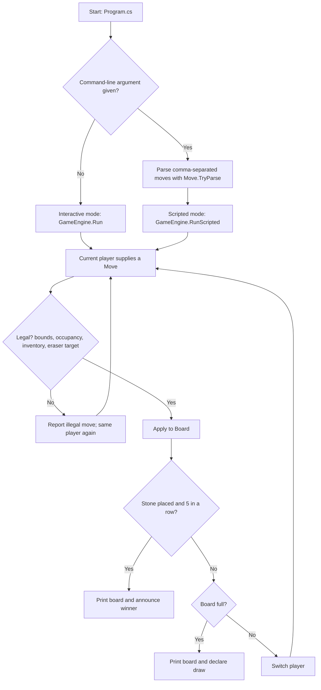

# GomokuPlus

> A C# console take on Gomoku (five-in-a-row) that adds heavy stones and eraser stones to the classic game.

---

## Overview

GomokuPlus is a turn-based console strategy game built for the QUT unit IFN584 Object-Oriented Design and Development. It adds two special moves to classic Gomoku: a **heavy stone** that can't be erased, and an **eraser** that removes an opponent's stone. The code is structured to show clean object-oriented design.

### Problem
* **The Challenge:** Classic Gomoku is simple, but once you add stone types, per-player inventories and several ways to supply moves (a human at the keyboard, a computer, a test script), the rules logic can easily get tangled up with console input and output.
* **The Impact:** When rules and I/O are mixed, the game is hard to test automatically, hard to extend with new move types, and hard to reuse with other kinds of player.

### Solution & Key Metrics
GomokuPlus handles this with a thin game engine that runs a small domain model. The board, cells, players and moves never call `Console` for rules decisions. Each move source produces the same `Move` object, and the engine checks every move with the same validation rules.

* **🧩 Board size:** 10 x 10 grid (100 cells), rendered as a bordered ASCII table with 1-based row and column labels.
* **🎯 Move types:** 3 move types: `O` (ordinary), `H` (heavy) and `E` (eraser).
* **💎 Special stones:** each player has 2 heavy stones and 2 erasers.
* **🧭 Win detection:** checks 4 directions (horizontal, vertical and both diagonals) through the last stone placed, looking for 5 in a row.
* **🏗️ Codebase:** 10 C# types (6 classes, 2 records, 2 enums) in 9 source files, 544 lines of C# in total (466 non-blank).

---

## How It Works

Here is a high-level overview of the system architecture and data flow:





1. **Start:** `Program.cs` builds a 10 x 10 `Board` and two `HumanPlayer`s, then hands them to a `GameEngine`.
2. **Get a move:** in interactive mode the current player's `GetNextMove` reads console input. In scripted mode the moves come from the parsed command-line string. Either way the result is a `Move` created by `Move.TryParse`.
3. **Validate and apply:** `GameEngine.Apply` checks bounds, occupancy, remaining heavy stones or erasers, and eraser targets, then changes the board only through `Board.TryPlace` or `Board.TryRemove`.
4. **Check the result:** after a stone is placed, `Board.CheckWin` counts along the 4 directions through that cell. `Board.IsFull` detects a draw.
5. **Next turn:** the turn passes only after a legal move. An illegal move gives the same player another try.

---

## Tech Stack

- **Language:** C# (nullable reference types and implicit usings enabled)
- **Runtime:** .NET 10 (`net10.0`) console application
- **Dependencies:** none beyond the .NET base class library

## Game Rules

These rules describe what the code does. Where `Docs/GAME_RULES.md` gives different placeholder defaults (15 x 15, 1 special stone each), the code takes precedence.

- **Players:** two players take turns. Player 1 moves first.
- **Symbols:** Player 1 uses `X` for ordinary stones and `@` for heavy stones. Player 2 uses `O` and `#`. Empty cells show as `.`.
- **Ordinary stone (`O`):** placed on any empty cell.
- **Heavy stone (`H`):** placed on any empty cell. It can't be erased. Each player has 2.
- **Eraser (`E`):** removes an opponent's **ordinary** stone. It can't target an empty cell, your own stone, or a heavy stone. It's used up and doesn't leave a stone behind. Each player has 2.
- **Win:** 5 or more of your own stones in an unbroken line, horizontally, vertically or diagonally. Ordinary and heavy stones both count.
- **Draw:** the board fills up and nobody has won.
- **Illegal moves:** the move is rejected with a reason, and the same player tries again.

## Getting Started

**Prerequisites:** [.NET 10 SDK](https://dotnet.microsoft.com/download).

```bash
git clone https://github.com/matt94317/gomokuplus.git
cd gomokuplus/GomokuPlus
dotnet run
```

This starts a Human vs. Human game. Enter each move as `<O|H|E><row>:<col>`. Rows and columns are 1-based, and the move letter isn't case-sensitive.

| Input  | Meaning                                              |
| :----- | :--------------------------------------------------- |
| `O3:4` | Place an ordinary stone at row 3, column 4           |
| `H5:5` | Place a heavy stone at row 5, column 5               |
| `E2:2` | Erase the opponent's ordinary stone at row 2, column 2 |

### Automated Testing Mode

To run a scripted game with no prompts, pass one comma-separated string of moves as the only argument. Players alternate in the same way as in interactive mode, with the same rules. Illegal moves are reported and don't pass the turn, and tokens that can't be parsed are skipped. Only the final board is printed, along with the winner or draw message if the game ended.

```bash
dotnet run "O3:2,O3:3,O3:1,O4:3,O3:4,O5:3,E3:3,H3:3"
```

In this example Player 1 erases Player 2's ordinary stone at 3:3 and Player 2 then puts a heavy stone on the same cell.

## OOP Design

- **Abstraction and inheritance:** `Player` is an abstract base class with `abstract Move GetNextMove(Board)`. `HumanPlayer` and `ComputerPlayer` both inherit from it.
- **Polymorphism:** `GameEngine` calls `current.GetNextMove(_board)` without knowing which kind of player it has. `HumanPlayer` reads the console, and `ComputerPlayer` picks a random empty cell.
- **Encapsulation:** the board's grid is `private readonly Cell?[,]` and changes only through `TryPlace` and `TryRemove`. `Cell.Owner`, `Cell.StoneType` and the player inventories have private setters and change only through intent-named methods (`PlaceHeavy`, `UseEraser` and so on).
- **Separation of concerns:** `Board.Render()` returns a string and the model classes contain no rules-related `Console` calls. `GameEngine` is the only class that prints the board. `HumanPlayer` handles its own console input.
- **Value types:** `Position` is an immutable `readonly record struct` and `Move` is a `sealed record`, so both are compared by value. All parsing goes through `Move.TryParse`, which converts 1-based input to 0-based positions in one place.

For design notes, see [`Docs/Implementation_Plan.md`](Docs/Implementation_Plan.md) and [`Docs/OOP_Design_Concepts.md`](Docs/OOP_Design_Concepts.md). The original rules draft is in [`Docs/GAME_RULES.md`](Docs/GAME_RULES.md).

## Project Structure

```
gomokuplus/
├── Docs/
│   ├── GAME_RULES.md            # Rules draft (placeholder defaults)
│   ├── Implementation_Plan.md   # Architecture and phase plan
│   ├── OOP_Design_Concepts.md   # General OOP reference notes
│   └── as1.pdf                  # Assignment specification
├── GomokuPlus/
│   ├── GomokuPlus.csproj        # .NET 10 console project
│   ├── Program.cs               # Entry point, chooses interactive or scripted mode
│   ├── Engine/
│   │   └── GameEngine.cs        # Turn loop, move validation, win and draw handling
│   ├── Models/
│   │   ├── Board.cs             # Grid, rendering, win detection
│   │   ├── Cell.cs              # Cell state and StoneType enum
│   │   ├── Player.cs            # Abstract player with special-stone inventory
│   │   ├── HumanPlayer.cs       # Console input player
│   │   ├── ComputerPlayer.cs    # Random-move player (not yet wired into Program.cs)
│   │   ├── Move.cs              # Move record, MoveKind enum, parser
│   │   └── Position.cs          # 0-based coordinate value type
│   ├── IO/                      # Empty placeholder
│   ├── Persistence/             # Empty placeholder
│   └── Utils/                   # Empty placeholder
└── Recording/                   # Placeholder for the asciinema recording
```

### Roadmap

- **Human vs. Computer mode:** `ComputerPlayer` exists, but `Program.cs` always creates two `HumanPlayer`s and there's no way to choose a mode yet.
- **Save / load:** the `Persistence/` folder is an empty placeholder and no save or load code exists yet.

---

## Assignment Submission (IFN584)

- **Author:** SHAOKUAN YU
- **Unit:** IFN584 Object-Oriented Design and Development
- **Recording File:** `StudentID.cast` (replace with your own student ID)

### Feature Implementation Claim Table

| Requirement                       | Status                | asciinema Timestamp (mm:ss) | Notes |
| :-------------------------------- | :-------------------- | :-------------------------- | :---- |
| **Human vs. human (HvH) mode**    | Working / Not Working | 01:00                       | N/A   |
| **Human vs. computer (HvC) mode** | Working / Not Working | 02:00                       | N/A   |
| **Save / load state persistence** | Working / Not Working | 03:00                       | N/A   |
| **Heavy stone**                   | Working / Not Working | 04:00                       | N/A   |
| **Eraser stone**                  | Working / Not Working | 05:00                       | N/A   |
| **Automated testing script mode** | Working / Not Working | 06:00                       | N/A   |
